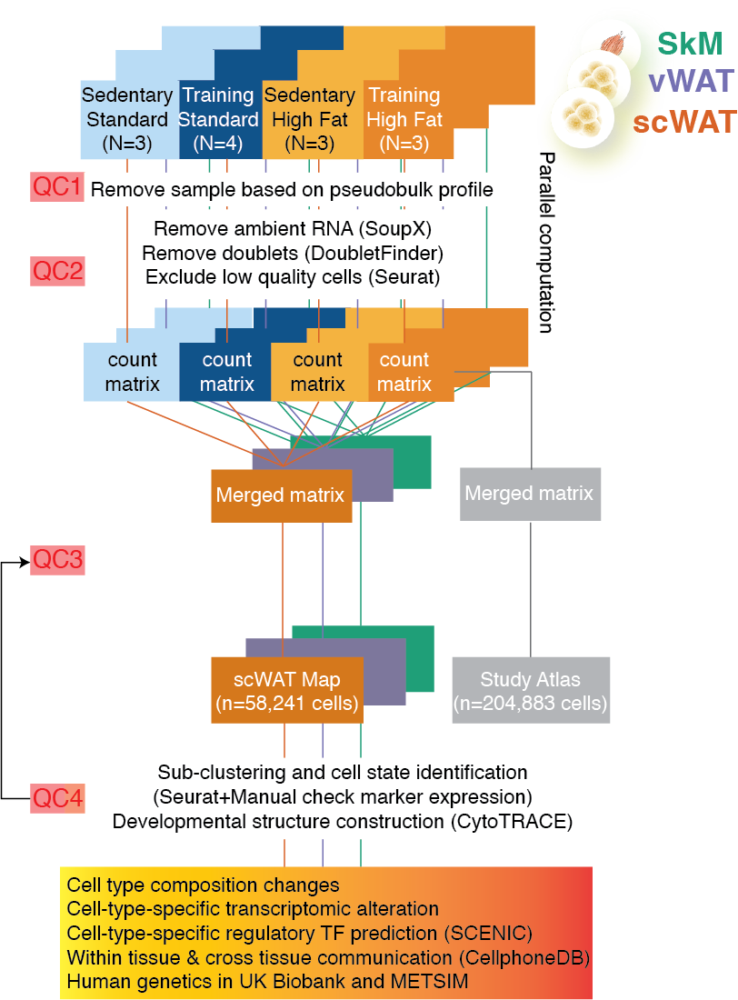

# Single-cell dissection of multi-tissue responses to obesity and exercise training
Single-cell and bulk RNA-seq analysis pipelines used in the project.

Manuscript on BioRxiv: [Single-cell dissection of obesity-exercise axis in adipose-muscle tissues](https://www.biorxiv.org/content/10.1101/2021.11.22.469622v1)

Companion interactive website: (http://scmetab.mit.edu/)

Single-cell pipeline illustration:

